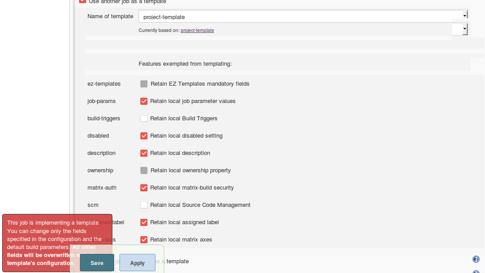

Allows you to use any job as a template for other jobs.


Using EZ-Templates
==================


Creating a template
-------------
Any Jenkins job can be used as a template
* Select `Allow this job to be used as a template`

A template can be a runnable job in its own right or be disabled and used only as a parent for "real" jobs.


:exclamation: WARNING: Templates have the capacity to magnify a bad decision so should never be used without an automated backup
solution in place. [ThinBackup][5] plugin is a good candidate for this.

Using a template
-------------------
### Existing jobs

Any Jenkins job can inherit from a template of the _same job type_. 
* Select `Use another job as a template` and enter the template's name
* Click `Apply`.  When you open the job after this, you will see the configuration copied in from the template.



:exclamation: The same job type (e.g. Maven/Freestyle) is important.

### New jobs

Choose `New Item > Copy existing item` and enter the template's name. The new job will be automatically created as an implementation.


Customising the implementation
--------------

Synchronisation happens whenever an implementation job or its template is saved. The implementation overwrites its config with that of the template, discarding any local changes.

Only configured items (see `Advanced` section) are retained.

:exclamation: External edits are not monitored, users must manually Configure>Save after changing the raw `config.xml`.

#### Job Parameters

One of those is the [Parameters][1] section.

* New parameters added to the template are added to the implementation
* Old parameters not in the template are removed from the implementation
    * :exclamation: Renaming a template parameter counts as a removal and addition - it is not synched as a "rename" and you will lose any customisation.
* Existing parameters are synchronised
    * The parameters' Default Values are retained by the implementation.
    * :exclamation: You cannot delete choices from a choice parameter, this would require a full remove/add of the property to reset the implementations.

Usecases
========
Not everything can be parameterised in a Jenkins job config. Here's a few sample uses

* SCM Repository URL can be a param, allowing completely different projects to be built with the same template
    * Alternatively the param could simply the Git branch (e.g. ```master```, ```feature```)
* Combined with [NodeLabel plugin][2], implementations can specify build node requirements
    * e.g. Only build on Linux or boxes with IPv6
* [Parameterized Trigger][3] and [Conditional BuildStep][4] plugins are the basis of many flexible configurations based on job parameters

[1]: https://wiki.jenkins-ci.org/display/JENKINS/Parameterized+Build
[2]: https://wiki.jenkins-ci.org/display/JENKINS/NodeLabel+Parameter+Plugin
[3]: https://wiki.jenkins-ci.org/display/JENKINS/Parameterized+Trigger+Plugin
[4]: https://wiki.jenkins-ci.org/display/JENKINS/Conditional+BuildStep+Plugin
[5]: https://wiki.jenkins-ci.org/display/JENKINS/thinBackup
